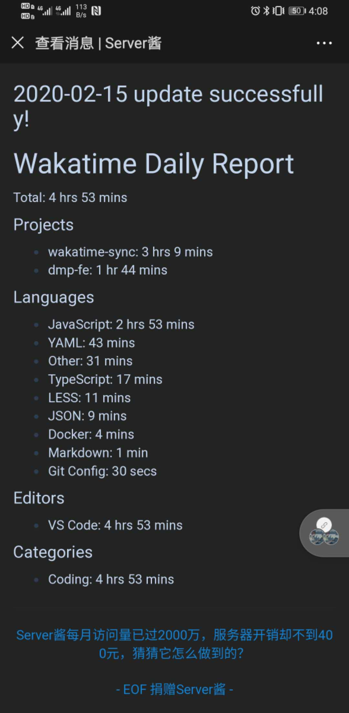
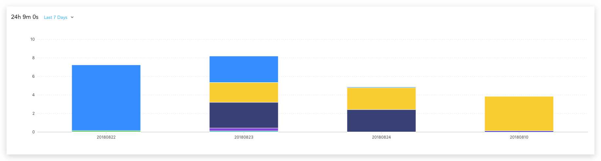

  <h3 align="center">wakatime-sync</h3>
  
Update Wakatime summary data to your gist every day

---

> If you only need notify wakatime daily report, you can check out [wakatime-notify](https://github.com/superman66/wakatime-notify)

## Setup

### Prep work

1. Create a new public GitHub Gist (https://gist.github.com/)
1. Create a token with the `gist` scope and copy it. (https://github.com/settings/tokens/new)
1. Create a WakaTime account (https://wakatime.com/signup)
1. In your account settings, copy the existing WakaTime API Key (https://wakatime.com/settings/account)

### Project setup

1. Fork this repo
2. Go to the repo **Settings > Secrets**
3. Add the following environment variables:
   - **GH_TOKEN:** The GitHub token generated above.
   - **WAKATIME_API_KEY:** The API key for your WakaTime account.
   - **GIST_ID:** The ID portion from your gist url: `https://gist.github.com/superman66/`**`75f3b2ec23c7f69594ca3d9e8b7ea81d`**..
4. Run workflow manually. Because workflows aren’t being run on forked repository.

### Push Daily Report to Wechat

if you are using Wechat, you can use **ServerChan(http://sc.ftqq.com/)** to push wakatime daily report to your Wechat.

#### Settting

1. Create a ServerChan account (https://sct.ftqq.com/)
2. Copy SCKEY (https://sct.ftqq.com/sendkey)
3. Bind your micromessage in ServerChan
4. Add SCKEY to repo **Secrets**: **SCU_KEY**

after that, you will receive Wakatime daily report everyday.

  

## Warning
In addition to a specific file's contents being truncated, the entire files list may be truncated if the total number exceeds 300 files. If the top level truncated key is true, only the first 300 files have been returned in the files list. If you need to fetch all of the gist's files, you'll need to clone the gist via the URL provided by git_pull_url.

[Gist Truncation](https://docs.github.com/en/rest/gists/gists?apiVersion=2022-11-28#truncation)

## More Usage

you can send the daily report to you email, telegram, Slack or other IM.
If you are interest in it, take a issue or PR.

## How can I use this data

You can use this data in Wakatime Dashboard(http://wakatime.chenhuichao.com).

You input the Gist ID, then you can see the report.

  

