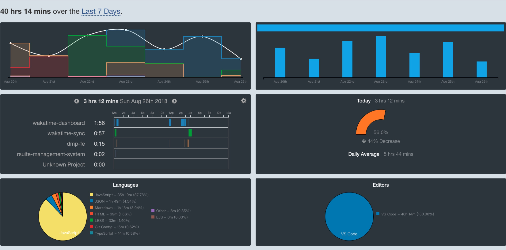
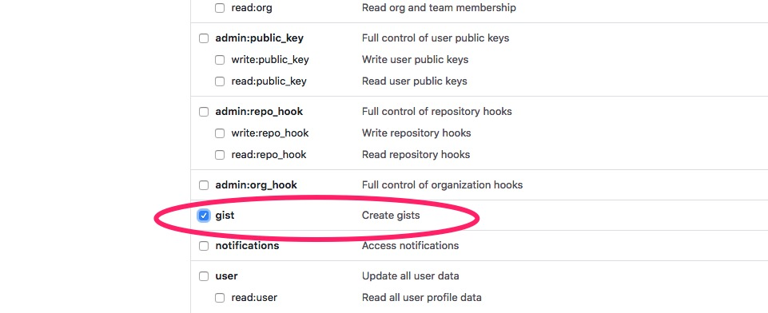
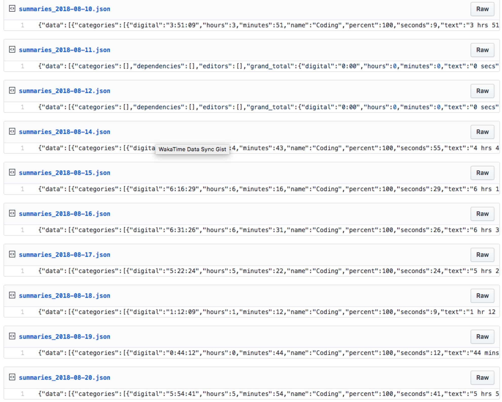

# Wakatime Sync To Gist

> Waktime 是一款专门为程序员打造的时间统计工具。可以在各大编辑器、IDE 安装插件，然后统计你的 coding 时间。统计的维度包括：在具体项目的时长、所用的操作系统、所用的编辑器、所用的语言等。更多具体的可以前往 [Wakatime 官网](https://wakatime.com/).对于程序员而言，我强烈建议每个人都去使用 WakaTime。这样就能非常详细的记录你每天在 coding 的时间。

这是我自己的 WakaTime 统计首页：


WakaTime 非常完美，但是它有区分免费版和付费版。免费版只能保持两个礼拜的 Dashboard History，而付费版则要 \$9 每个月。这样使用免费版的你，就无法查看历史更多的统计数据了。用订阅去支持这样的优秀的工具是件好事，可以帮助企业获得更好的收入，进而提升工具的质量和用户体验。

但是对于可能不太需要去看历史统计数据，但是可能偶尔需要看一看的人（比如一个季度或者一年看一次等），每个月花 \$9 的成本确实不低。因此就产生了 **wakatiem-sync** 这个项目。

`wakatime-sync` 可以帮助你每天定时去请求 WakaTime 的统计数据，然后将数据同步到 Gist 上面。这样就可以永远的将你的统计数据保存到 Gist 上面，随时想看都可以。
目前只同步该接口的数据 `https://wakatime.com/api/v1/users/current/summaries`。因为通过该接口，基本上就能获取你所需要的各类信息。

通过 [Wakatime Dashboard](https://github.com/superman66/wakatime-dashboard)这个项目，你就可以在上面保存查看 Gist 上面的统计数据，突破 WakaTime 免费版只能查看过去 14 天的数据。


如果觉得对你有帮助，请点波 star 支持下作者，非常感谢~

## ChANGELOG

- 使用[Server 酱](http://sc.ftqq.com/3.version)推送每天同步的状态到微信
- 添加 Dockerfile，支持 docker 部署

## 用法

**第一步**

你需要先去 [Gist](https://gist.github.com) 创建一个 Gist，记得设置为 `secret`.

**第二步**

git clone 该项目到你的本地或者你的服务器。由于需要每天定时跑任务同步数据到 Gist，因此强烈建议有服务器的同学直接部署到自己的服务器，这样部署完了之后就不需要管它了，脚本会在每天的 `每天1点30分30秒` 执行。
如果没有服务器的同学，也可以部署到本地。至于部署到本地效果如何，我没有测试过。

```
git clone https://github.com/superman66/wakatime-sync.git && cd wakatime-sync
npm install
// 项目通过 pm2 来管理 node，因此你还需要全局安装 pm2，如果你还没有安装过。
npm i pm2 -g
```

**第三步**

在根目录下创建 `config.json` 配置文件，将第一步创建的 Gist ID 填入。同时还需要:

- wakatime apiKey - 用于请求 wakatime api 的 key。[Waketime Setting](https://wakatime.com/settings/account)
- gistToken - 用于创建和修改 Gist 的 Token。[生成 Personal access tokens](https://github.com/settings/tokens)

需要注意的是，生成 token 需要勾选 gist 权限:


```json
// config.json
{
  "wakatimeApiKey": "xxxxxxxxx",
  "gistToken": "xxxxxxxxx",
  "syncGistId": "xxxxxxxxx"
}
```

> Waketime apikey 截图


安装完依赖后，你可以通过几个命令来运行该项目：

- `npm start` 启动 pm2 进程
- `npm run build` 构建项目

如果是部署到服务器，则可以直接运行 `npm run pm2` 即可。

这是我保存在 Gist 上的数据


## Docker 部署

在配置好上面所说的数据后，可以直接在服务器使用 docker 进行部署（前提是已安装 docker 服务）。

```
// 构建镜像
docker build -t wakatime-sync .

// 镜像构建成功后，直接运行容器即可
docker run -d wakatime-sync
```

## 定时任务

该项目使用的是 `node-schedule` 来执行定时任务的，我的设置是`每天1点30分30秒`执行（该时间是基于服务器的时间）。如果你要更改时间的话，只需要在 `src/server/index.js` 中更改即可：

```js
// 每天1点30分30秒执行该job
const job = schedule.scheduleJob('30 30 1 * * *', function() {
  syncWakaTimeToGist(config.syncGistId)
})
```

node-schedule 的规则如下：

```
*    *    *    *    *    *
┬    ┬    ┬    ┬    ┬    ┬
│    │    │    │    │    │
│    │    │    │    │    └ day of week (0 - 7) (0 or 7 is Sun)
│    │    │    │    └───── month (1 - 12)
│    │    │    └────────── day of month (1 - 31)
│    │    └─────────────── hour (0 - 23)
│    └──────────────────── minute (0 - 59)
└───────────────────────── second (0 - 59, OPTIONAL)
```

更多请看 [node-schedule 文档](https://github.com/node-schedule/node-schedule)。

## 推送同步状态到微信

不得不说 [Server 酱](http://sc.ftqq.com/3.version) 是个好东西，简单快捷方便。感谢作者创造了一个这么好用到工具。
Server 酱到具体配置去官网看就可以了。没有任何难度，只要能看懂中文，就能懂得如何使用。
把 Server 酱提供的 `SCKEY` 放到前面说的 `config.json`，新建 `SCUKey` 字段：

```json
// config.json
{
  "wakatimeApiKey": "xxxxxxxxx",
  "gistToken": "xxxxxxxxx",
  "syncGistId": "xxxxxxxxx",
  "SCUKey": "xxxxx"
}
```

这样就可以在每次同步成功或者失败时，将消息推送到你在 Server 酱 后台绑定的微信上。
