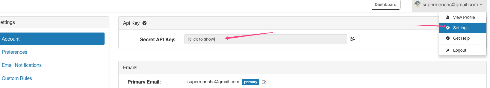

# Wakatime Sync To Gist

> Waktime 是一款专门为程序员打造的时间统计工具。可以在各大编辑器、IDE 安装插件，然后统计你的 coding 时间。统计的维度包括：在具体项目的时长、所用的操作系统、所用的编辑器、所用的语言等。更多具体的可以前往 [Wakatime 官网](https://wakatime.com/).当然了，WakaTime 也提供免费版和付费版的功能。免费版最多只能查看过去 14 天的统计数据。一旦时间过去了，就再也看不到统计数据了。这点无可厚非，毕竟 WakaTime 还是需要盈利和赚钱的。

这个项目可以帮助你每天定时去请求 WakaTime 的统计数据，然后将数据同步到 Gist 上面。这样就可以永远的将你的统计数据保存到 Gist 上面，随时想看都可以。
然后再通过 [Wakatime Dashboard](https://github.com/superman66/wakatime-dashboard)，填入你的 Gist ID，就可以在上面查看 Gist 上面的统计数据，突破 WakaTime 免费版只能查看过去 14 天的数据。


如果觉得对你有帮助，请点波 star 支持下作者，非常感谢~

## 用法

**第一步:**
你需要先去 [Gist](https://gist.github.com) 创建一个 Gist，记得设置为 `secret`.

**第二步**
git clone 该项目到你的本地或者你的服务器。由于需要每天定时跑任务同步数据到 Gist，因此强烈建议有服务器的同学直接部署到自己的服务器，这样部署完了之后就不需要管它了，脚本会在每天的 `每天1点30分30秒` 执行。
如果没有服务器的同学，也可以部署到本地。至于部署到本地效果如何，我没有测试过。

```
git clone https://github.com/superman66/wakatime-sync.git && cd wakatime-sync
npm install
// 项目通过 pm2 来管理 node，因此你还需要全局安装 pm2，如果你还没有安装过。
npm i pm2 -g
```

**第三步**
在 `src` 文件夹下创建 `config.json`，将第一步创建的 Gist ID 填入。同时还需要:

- wakatime apiKey - [Waketiem Setting](https://wakatime.com/settings/account)
- gistToken - [生成 Personal access tokens](https://github.com/settings/tokens)



```json
{
  "wakatimeApiKey": "xxxxxxxxx",
  "gistToken": "xxxxxxxxx",
  "syncGistId": "xxxxxxxxx"
}
```

安装完依赖后，你可以通过几个命令来运行该项目：

- `npm run start` 本地启动该脚本
- `npm run build` 构建项目
- `npm run pm2` 构建项目并通过 pm2 启动管理项目

如果是部署到服务器，则可以直接运行 `npm run pm2` 即可。

## 定时任务

该项目使用的是 `node-schedule` 来执行定时任务的，我的设置是`每天1点30分30秒`执行（该时间是基于服务器的时间）。如果你要更改时间的话，只需要在 `src/server/index.js` 中更改即可：

```js
// 每天1点30分30秒执行该job
const job = schedule.scheduleJob('30 30 1 * * *', function() {
  syncWakaTimeToGist(config.syncGistId)
})
```

node-schedule 的规则如下：

```
*    *    *    *    *    *
┬    ┬    ┬    ┬    ┬    ┬
│    │    │    │    │    │
│    │    │    │    │    └ day of week (0 - 7) (0 or 7 is Sun)
│    │    │    │    └───── month (1 - 12)
│    │    │    └────────── day of month (1 - 31)
│    │    └─────────────── hour (0 - 23)
│    └──────────────────── minute (0 - 59)
└───────────────────────── second (0 - 59, OPTIONAL)
```

更多请看 [node-schedule 文档](https://github.com/node-schedule/node-schedule)。
