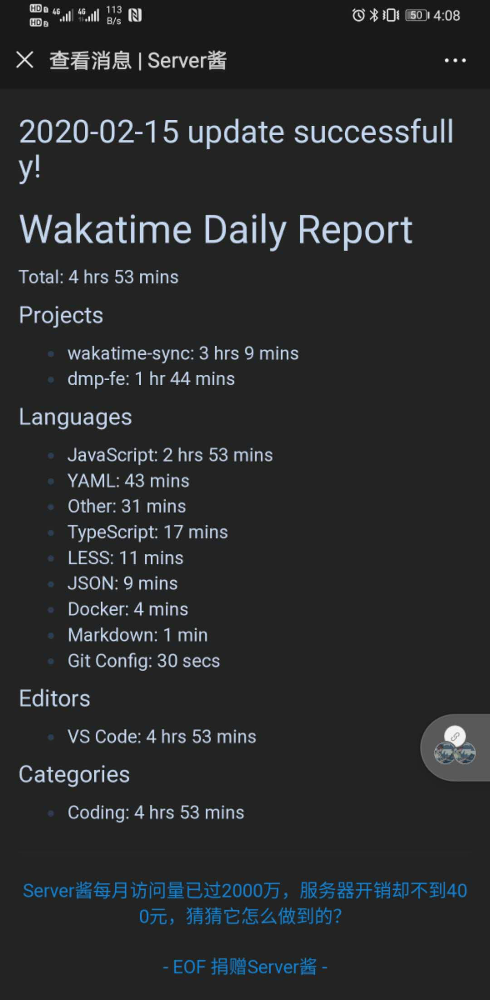
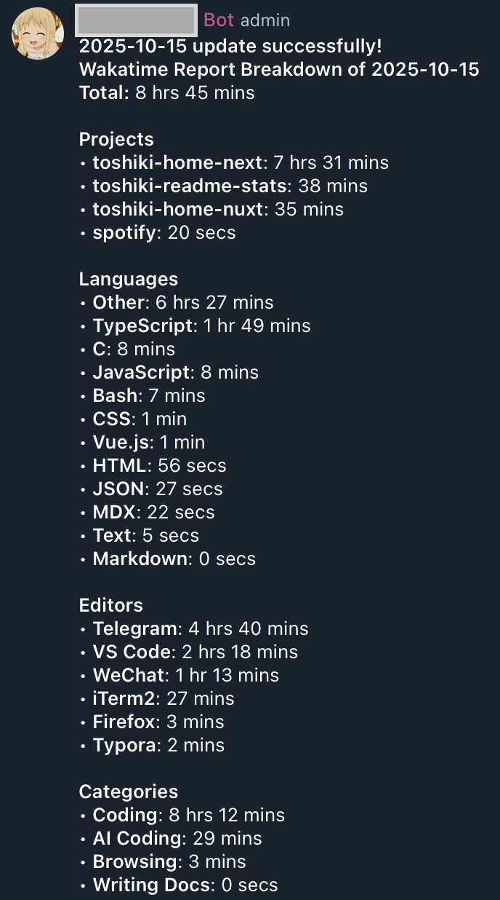
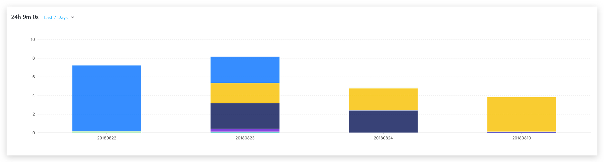

<p align="center">
  <h3 align="center">wakatime-sync</h3>
  <p align="center">Update Wakatime summary data to your gist every day</p>
</p>

---

> If you only need notify wakatime daily report, you can check out [wakatime-notify](https://github.com/superman66/wakatime-notify)

## Setup

### Prep work

1. Create a new public GitHub Gist (https://gist.github.com/)
1. Create a token with the `gist` scope and copy it. (https://github.com/settings/tokens/new)
1. Create a WakaTime account (https://wakatime.com/signup)
1. In your account settings, copy the existing WakaTime API Key (https://wakatime.com/settings/account)

### Project setup

1. Fork this repo
2. Go to the repo **Settings > Secrets**
3. Add the following environment variables:
   - **GH_TOKEN:** The GitHub token generated above.
   - **WAKATIME_API_KEY:** The API key for your WakaTime account.
   - **GIST_ID:** The ID portion from your gist url: `https://gist.github.com/superman66/`**`75f3b2ec23c7f69594ca3d9e8b7ea81d`**..
4. Run workflow manually. Because workflows aren’t being run on forked repository.

### Push Daily Report to Wechat

if you are using Wechat, you can use **ServerChan(http://sc.ftqq.com/)** to push wakatime daily report to your Wechat.

#### Setting

1. Create a ServerChan account (https://sct.ftqq.com/)
2. Copy SCKEY (https://sct.ftqq.com/sendkey)
3. Bind your micromessage in ServerChan
4. Add SCKEY to repo **Secrets**: **SCU_KEY**

after that, you will receive Wakatime daily report everyday.

<p align="center">
  
</p>

### Push daily Report to Telegram

If you are a regular Telegram user, you may use the built in Telegram bot API to automatically push a daily report breakdown with pseudo-markdown formatting to your specified group chat/channel with its respective `chatId` via a Teleram bot, preview as followed,

<p align="center">
  
</p>

1. Create a new bot at [@botfather](https://t.me/botfather), copy and save the bot API key.
2. Add the bot to your group/channel with **admin preivilleges**, or else bot will be blocked from pushing a message to Telegram.
3. Add [@ShowJsonBot](https://t.me/ShowJsonBot) to your chat/channel as it will automatically return the chat info in JSON format as followed, notice the `id` field under `chat` field, the numeric identifier starting with `-100` is the `chatId` of your current chat/channel session, copy the value.
   ```json
    {
    "update_id": 937349678,
    "my_chat_member": {
     "chat": {
      "id": -100xxxxxxxxx,
      "title": "Some title",
      "username": "Some username",
      "is_forum": true,
      "type": "supergroup"
     },
     ... // rest of the JSON output
    }
   }
   ```
4. Append the two environment variables `TELEGRAM_BOT_TOKEN` and `TELEGRAM_CHAT_ID` in the repository secretes on the setting page of the repository, head to the workflow tab and manually run the action via `workflow_dispatch` to test if the integration succeeds, if you recieve a message akin to the screenshot attached above, viola.

> Optionally, you may add a [`keep-alive-workflow`](https://github.com/marketplace/actions/keepalive-workflow) to automatically keep the overall workflow active in compliance with GitHub Actions’ policy, which otherwise suspends workflows due to repo inactivity if there are no commmits pushed to the repo. But this configuration MIGHT VIOLATE AGINST GITHUB's TOS as the original repository of this workflow was removed due to violation of such terms; which may result in account suspension, so proceed and use at your own discretion.
>
> ```yml
> steps:
>   - uses: actions/checkout@master
>   - name: Update gist
>     uses: superman66/wakatime-sync@master
>     env:
>       GH_TOKEN: ${{ secrets.GH_TOKEN }}
>       GIST_ID: ${{ secrets.GIST_ID}}
>       WAKATIME_API_KEY: ${{ secrets.WAKATIME_API_KEY }}
>       SCU_KEY: ${{ secrets.SCU_KEY }}
>       TELEGRAM_BOT_TOKEN: ${{ secrets.TELEGRAM_BOT_TOKEN }}
>       TELEGRAM_CHAT_ID: ${{ secrets.TELEGRAM_CHAT_ID }}
>   # - uses: world-executed/keepalive-workflow@master
> ```
>
> Once you forked the repo, uncomment the `#` of keep-alive workflow if you opt to use.

## Warning

In addition to a specific file's contents being truncated, the entire files list may be truncated if the total number exceeds 300 files. If the top level truncated key is true, only the first 300 files have been returned in the files list. If you need to fetch all of the gist's files, you'll need to clone the gist via the URL provided by git_pull_url.

[Gist Truncation](https://docs.github.com/en/rest/gists/gists?apiVersion=2022-11-28#truncation)

## More Usage

you can send the daily report to you email, ~~telegram~~, Slack or other IM.
If you are interest in it, take a issue or PR.

## How can I use this data

You can use this data in Wakatime Dashboard(http://wakatime.chenhuichao.com).

You input the Gist ID, then you can see the report.

<p align="center">
  
</p>
